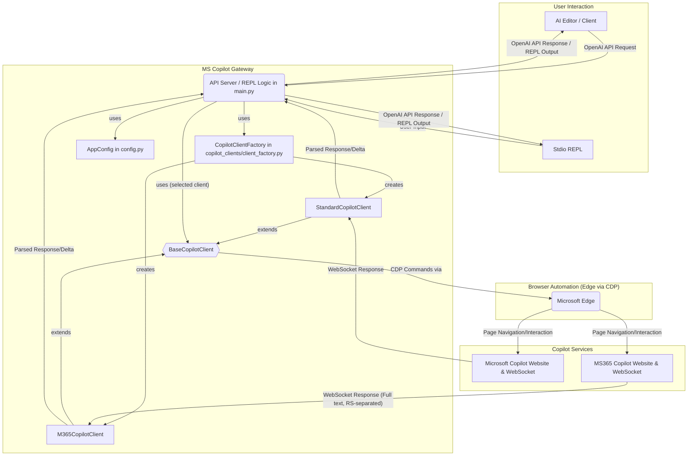

# MS Copilot Gateway: MS365 Copilot Integration Plan

## 1. Background and Objectives

Currently, the MS Copilot Gateway is implemented with the assumption of connecting to Microsoft Copilot (`copilot.microsoft.com`). This plan aims to enable support for Microsoft 365 Copilot (`m365.cloud.microsoft`) in addition to the existing functionality.

MS365 Copilot differs from the standard Copilot in the following aspects:

*   **Connection URLs:**
    *   Web page: `https://m365.cloud.microsoft/chat` (or `https://m365.cloud.microsoft/chat/?...`)
    *   WebSocket: `wss://substrate.office.com/m365Copilot/Chathub/...`
*   **Redirection:** Potential automatic redirection from `https://copilot.microsoft.com` if Enterprise Data Protection is enabled.
*   **Authentication:** May involve intermediate authentication pages before login, requiring adjustments to waiting logic.
*   **WebSocket Communication:**
    *   A new WebSocket connection is established for each prompt.
    *   Responses are sent as full text rather than deltas.
    *   Messages are transmitted as one or more JSON objects separated by an RS (Record Separator, U+001E) character.
*   **Character Limit:** 8000 characters (standard Copilot is typically 10240 characters).

This project will modify the gateway to address these differences and allow users to select which Copilot service to use.

## 2. Design Principles

To enhance flexibility and maintainability, the following design principles will be adopted:

*   **CopilotClient Abstraction and Concrete Classes (Strategy Pattern-like):**
    *   Define a `BaseCopilotClient` with common logic.
    *   Create concrete classes `StandardCopilotClient` and `M365CopilotClient` inheriting from `BaseCopilotClient`.
    *   Implement Copilot-specific logic (URLs, WebSocket handling, message parsing, UI selectors, etc.) in respective concrete classes by overriding methods or as unique methods.
*   **Separation of Configuration Management:**
    *   Introduce a `config.py` file to manage settings for each Copilot type (URLs, selectors, character limits, etc.).
*   **Factory Pattern for Client Instantiation:**
    *   Implement a `CopilotClientFactory` to create the appropriate `CopilotClient` instance based on runtime arguments.

## 3. Key Modifications

### 3.1. Configuration and Connection Endpoint Management (`config.py`, `main.py`)

*   **New `config.py`:**
    *   Move and extend `AppSettings` (Pydantic model) here.
    *   Define connection URLs (web page, WebSocket), UI selectors, character limits, etc., for both Standard Copilot and MS365 Copilot.
*   **Changes in `main.py`:**
    *   Add a command-line argument (`--copilot-type <standard|m365>`) to select the Copilot type.
    *   Use `CopilotClientFactory` to instantiate the selected Copilot client.
    *   Enhance the waiting logic in `BaseCopilotClient`'s `initialize_page` method (e.g., longer timeouts, checking for specific element appearance) to handle potential authentication pages.

### 3.2. CopilotClient Refactoring (`copilot_clients/` directory)

*   **`copilot_clients/base_client.py` (`BaseCopilotClient`):**
    *   Implement common functionalities: Edge browser launch/termination, basic CDP command sending, page initialization, core UI interaction logic (element identification, input, clicks).
    *   Define the structure for `send_message_and_get_response` (calling UI operations and WebSocket handling); specific WebSocket logic will be in subclasses.
*   **`copilot_clients/standard_client.py` (`StandardCopilotClient`):**
    *   Implement logic for Standard Copilot (`copilot.microsoft.com`) based on the existing `CopilotClient`.
    *   Maintain a single chat WebSocket session and perform delta streaming.
*   **`copilot_clients/m365_client.py` (`M365CopilotClient`):**
    *   Implement logic for MS365 Copilot.
    *   In `send_message_and_get_response`, implement logic to establish and manage new chat WebSocket connections per prompt.
    *   Implement parsing for RS (U+001E) character-separated JSON objects from WebSocket data.
    *   Implement logic to calculate deltas from full responses for API client streaming.
*   **`copilot_clients/client_factory.py` (`CopilotClientFactory`):**
    *   Read configuration from `config.py` and instantiate `StandardCopilotClient` or `M365CopilotClient` based on the specified `copilot_type`.

### 3.3. Specialized WebSocket Communication Handling

*   **`StandardCopilotClient`:**
    *   Continue monitoring `Network.webSocketFrameReceived` events and extracting delta text from `appendText` events.
*   **`M365CopilotClient`:**
    *   Monitor `Network.webSocketFrameReceived` (or similar) events.
    *   Split received `payloadData` by the RS character.
    *   Parse each JSON payload to extract the latest full text from message structures like `type:1, target:"update"`.
    *   Compare with the previously received full text to generate and `yield` the diff.
    *   Properly handle response completion signals (e.g., `type:2, invocationId:"..."` followed by `{"type":3,...}` or specific `target` values).

### 3.4. Character Limit Updates

*   Update `README.md` and, if necessary, within `M365CopilotClient`, add logic or information considering MS365 Copilot's character limit (8000 characters).

## 4. Proposed File Structure

```
ms-copilot-gateway/
├── .vscode/
├── .roo/
│   └── system-prompt-ms-copilot-gateway-assistant
├── copilot_clients/         # <-- New directory
│   ├── __init__.py
│   ├── base_client.py       # BaseCopilotClient (common logic)
│   ├── standard_client.py   # StandardCopilotClient (standard Copilot specific)
│   ├── m365_client.py       # M365CopilotClient (MS365 Copilot specific)
│   └── client_factory.py    # Factory to create CopilotClient instances
├── .gitignore
├── .python-version
├── .roomodes
├── main.py                  # FastAPI server, argument parsing, client initialization via factory
├── pyproject.toml
├── README.md
└── config.py                # <-- New: Configuration values for each Copilot type (URLs, selectors, etc.)
```

## 5. Architecture Diagrams

### 5.1. Overall Architecture



### 5.2. Class Diagram

```mermaid
classDiagram
    direction LR

    class BaseCopilotClient {
        <<Abstract>>
        +edge_path: str
        +debug_profile_dir: str
        +debugging_port: int
        #_cdp_message_id: int
        #edge_process: Popen
        #browser_ws_connection: WebSocketClientProtocol
        #cdp_session_id: str
        #target_id: str
        #is_page_initialized: bool

        +__init__(config: dict)
        +connect_to_browser()* : bool
        +initialize_page(copilot_url: str, critical_element_selector: str)* : bool
        +close()* : void
        +send_message_and_get_response(message: str)* : AsyncGenerator[str, None]
        #_send_cdp_command(method, params)
        #_find_page_target() : str
        #_attach_to_target(target_id: str) : str
        #_get_document_root_node_id() : int
        #_query_selector_node_id(parent_node_id: int, selector: str) : int
        #_focus_and_insert_text(node_id: int, text: str) : void
        #_click_submit_button(selector: str) : void
    }

    class StandardCopilotClient {
        +copilot_url: str
        +websocket_url_filter: str
        +user_input_selector: str
        +submit_button_selector: str
        #chat_websocket_request_id: str
        #is_first_message_sent: bool

        +__init__(config: dict)
        +connect() : bool // Override
        +send_message_and_get_response(message: str) : AsyncGenerator[str, None]  // Override
        #_capture_chat_websocket_id() : bool
        #_process_chat_ws_message(payload_data_str: str) : Optional[str]
    }

    class M365CopilotClient {
        +copilot_url: str  // M365 specific
        +websocket_url_filter: str // M365 specific
        +user_input_selector: str
        +submit_button_selector: str
        +max_prompt_length: int
        #current_m365_chat_ws_request_id: str
        #last_full_response_text: str

        +__init__(config: dict)
        +connect() : bool // Override
        +send_message_and_get_response(message: str) : AsyncGenerator[str, None] // Override
        #_capture_m365_chat_websocket_id() : Optional[str]
        #_process_chat_ws_message(raw_data: str) : Optional[str] // Handles RS, full text, diffing
    }

    class CopilotClientFactory {
        +create_client(app_settings: AppSettings) : Optional[BaseCopilotClient]
    }

    class AppSettings { // From config.py
      +edge_path: str
      +debug_profile_dir: str
      +debugging_port: int
      +copilot_type: str
      +standard_copilot: CopilotSettings
      +m365_copilot: CopilotSettings
      +get_active_copilot_settings() : CopilotSettings
    }
    
    class CopilotSettings { // Nested in AppSettings or separate in config.py
        +copilot_url: str
        +websocket_url_filter: str
        +user_input_selector: str
        +submit_button_selector: str
    }


    class MainApplication { // Represents logic in main.py
        -client: BaseCopilotClient
        -app_settings: AppSettings // Global settings instance
        -client_factory: CopilotClientFactory
        +main()
        +setup_fastapi_app()
        +run_stdio_repl()
    }

    BaseCopilotClient <|-- StandardCopilotClient
    BaseCopilotClient <|-- M365CopilotClient
    CopilotClientFactory ..> BaseCopilotClient : creates
    CopilotClientFactory ..> AppSettings : uses
    MainApplication o-- CopilotClientFactory
    MainApplication o-- AppSettings
    AppSettings *-- CopilotSettings

    note for BaseCopilotClient "Common CDP operations, Edge launch/close, etc.\n`send_message_and_get_response` defines\nthe skeleton for UI interaction and WebSocket handling,\nwith specific WebSocket logic in subclasses."
    note for StandardCopilotClient "Logic for copilot.microsoft.com.\nMaintains a single chat WebSocket session, delta streaming."
    note for M365CopilotClient "Logic for MS365 Copilot.\nPotential for new chat WebSocket per prompt.\nRS-separated, full response, delta generation."
```



## 6. Next Steps (Original Plan)

1.  Based on the plan above, start creating/modifying files.
2.  First, refactor to `BaseCopilotClient` and `StandardCopilotClient`, ensuring existing functionality is not broken.
3.  Next, begin implementation of `M365CopilotClient`, focusing on new WebSocket communication logic and testing.
4.  Implement the configuration file (`config.py`) and factory (`client_factory.py`) and integrate them with `main.py`.
5.  Test both Copilot types, debug.
6.  Update `README.md` (MS365 Copilot usage, notes, etc.).

*(This plan document itself was created during the refactoring process and reflects the design decisions made.)*