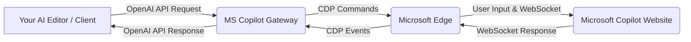

# MS Copilot Gateway (Experimental)

> **Note:** This is an experimental project. See "Important Considerations" below.

This Python script provides two main functionalities for interacting with Microsoft Copilot.

The general architecture is as follows:



**Functionalities:**

1.  **ChatGPT-compatible API Server**: Launches an HTTP server (using FastAPI and Uvicorn) that exposes an OpenAI-compatible API endpoint (`/v1/chat/completions`). This allows AI editors and other tools that support the OpenAI API format to use Microsoft Copilot as a backend. It supports streaming responses.
2.  **Stdio REPL Mode**: Allows direct interaction with Copilot via a command-line REPL (Read-Eval-Print Loop).

The interaction with Copilot is achieved by:
*   Launching Microsoft Edge with the remote debugging port enabled on Windows.
*   Navigating to the selected Copilot URL (either `https://copilot.microsoft.com/` for standard Copilot or `https://m365.cloud.microsoft/chat` for MS365 Copilot, configurable via a command-line argument).
*   Using the Chrome DevTools Protocol (CDP) to:
    *   Attach to the Copilot page.
    *   Enable network monitoring.
    *   Simulate typing the user's message into the chat input and clicking send.
    *   Monitor and stream WebSocket response messages.

## Status

This project provides a functional gateway to Copilot. Further enhancements and error handling are ongoing.

**Important Considerations:**

*   **Experimental Project**: This gateway is an experimental project. Due to the nature of interacting with Copilot via UI automation, its stability and long-term viability may be affected by changes to the Copilot website(s).
*   **Microsoft 365 Copilot Support (Highly Experimental)**:
    *   Support for Microsoft 365 Copilot (via `--copilot-type m365`) has been added but is **highly experimental and largely untested**.
    *   MS365 Copilot has different UI selectors, WebSocket behaviors (RS-separated JSON messages, full responses per update, potentially new WebSocket per prompt), and character limits (e.g., 8000 characters) compared to the standard `copilot.microsoft.com`.
    *   The implementation for MS365 Copilot in [`copilot_clients/m365_client.py`](copilot_clients/m365_client.py:1) attempts to address these differences, but requires thorough testing and likely adjustments.
    *   Configuration for MS365 Copilot (URLs, selectors) can be found and may need modification in [`config.py`](config.py:1).
*   **Character Limits**:
    *   Standard Microsoft Copilot (`copilot.microsoft.com`) typically has a character limit of around 10,240 characters.
    *   Microsoft 365 Copilot is reported to have a character limit of around 8,000 characters.
    *   This gateway's `--message-mode all` (for sending full conversation history on the first turn) combined with long system prompts can easily exceed these limits. For subsequent turns in a conversation when using `--message-mode all` with the standard Copilot client, the gateway now attempts to send only the last user message.
*   **No File Attachment Support**: This gateway currently does not support file attachments. Interactions are limited to text-based prompts and responses.
*   **Dedicated Debugging Profile**: For Chrome DevTools Protocol (CDP) automation, this script launches Microsoft Edge with a dedicated, separate user profile (typically located at `%TEMP%/edge_debug_profile_temp` or a similar path in your system's temporary directory, as defined by `debug_profile_dir` in [`config.py`](config.py:1)). This is a **necessary** measure due to security enhancements in Chromium-based browsers (including Edge version 136 and later).
    *   **Security Background**: Chromium intentionally restricts the use of the `--remote-debugging-port` (or `--remote-debugging-pipe`) with the *default* user data directory. This is a security measure to prevent malicious actors from exploiting the remote debugging feature to access sensitive user data, especially cookies, from the user's main profile.
    *   **Why a Separate Profile is Required**: To enable remote debugging for automation, a custom (non-default) user data directory must be specified (via the `--user-data-dir` switch). This script adheres to this requirement by creating and using a temporary profile. This ensures that the automation operates in an isolated environment, separate from your main browser profile and its data. It also uses a different encryption key for any data stored within this temporary profile, further protecting your main profile's data.
    *   **Data Handling**: Consequently, any browsing history, cookies, or site data (including logins) generated during the script's operation will be isolated to this temporary profile. If you log into any accounts or enter sensitive information, this data will reside in this separate profile directory. This script does not automatically clear this temporary profile upon exit. Please be mindful of any sensitive data that might be stored there if you perform such actions.

### Key Enhancements

*   **Improved multi-turn conversation stability**: The handling of the WebSocket `requestId` for chat messages has been refined. The `requestId` is now captured once during the first message exchange and reused for subsequent messages in the same session. This resolves issues where responses to second and later prompts were not being correctly processed by the script.
*   **Optimized page load wait time**: Reduced the timeout for waiting for the `Page.loadEventFired` event during initial browser connection to improve startup speed.

## Requirements

*   Python 3.10+ (as defined in `pyproject.toml`)
*   `uv` (for package management, optional but recommended)
*   Required Python libraries: `websockets`, `fastapi`, `uvicorn[standard]`, `colorlog`
*   Microsoft Edge installed on Windows

To install the dependencies:

**If you use `uv` (recommended):**
```bash
uv pip install -r pyproject.toml
```
This command will install the dependencies specified in the [`pyproject.toml`](pyproject.toml:1) file.

**If you use `pip`:**
```bash
pip install websockets fastapi "uvicorn[standard]" colorlog
```
Ensure these match the dependencies listed in [`pyproject.toml`](pyproject.toml:1).

## Usage

1.  Ensure the `edge_path` variable in [`config.py`](config.py:1) points to your `msedge.exe`.

### Server Mode (Default)

This mode starts an HTTP server compatible with the OpenAI Chat Completions API.

1.  Run the script:
    ```bash
    python main.py
    ```
2.  To specify a host and port (defaults to `0.0.0.0:8000`):
    ```bash
    python main.py --host 127.0.0.1 --port 8888
    ```
3.  To control how user messages from the client request are processed by the gateway before sending to Copilot, use the `--message-mode` option:
    *   `last` (default): Only the content of the last message with `role: "user"` is sent to Copilot.
    *   `all`: The content of all messages in the request are concatenated and sent to Copilot as a single prompt.
    Example:
    ```bash
    python main.py --message-mode all --port 8888
    ```
4.  To select the Copilot service to connect to (defaults to `standard`):
    *   `standard`: Connects to `copilot.microsoft.com`.
    *   `m365`: Connects to `m365.cloud.microsoft` (experimental, requires appropriate M365 Copilot access and may need configuration adjustments in `config.py`).
    ```bash
    python main.py --copilot-type standard
    # or
    python main.py --copilot-type m365
    ```
5.  To enable debug logging (sets log level to DEBUG and shows full prompts):
    ```bash
    python main.py --debug-logging
    ```
6.  The server will launch Edge, navigate to the selected Copilot service, and be ready to accept API requests.
7.  AI editors or clients can then be configured to use the endpoint: `http://<host>:<port>/v1/chat/completions`.

### Stdio REPL Mode

This mode allows direct command-line interaction with Copilot.

1.  Run the script with the `--stdio` flag:
    ```bash
    python main.py --stdio
    # To use with MS365 Copilot (experimental):
    python main.py --stdio --copilot-type m365
    ```
2.  The script will launch Edge, navigate to the selected Copilot service, and then present a `>` prompt.
3.  Type your message and press Enter to send it to Copilot. The response will be streamed to the console.
4.  Type `exit` or `quit` (or press `Ctrl+D`) at the prompt to close the script and Edge. You can also use `Ctrl+C` to interrupt.

## Usage with Roo Code

To use `ms-copilot-gateway` with Roo Code, you need to configure it as an LLM provider and register a custom mode.

### 1. Register as an LLM Provider

`ms-copilot-gateway` exposes an OpenAI-compatible API endpoint. You can register it in Roo Code as an "OpenAI-compatible" provider.

-   **Provider Type**: OpenAI-compatible
-   **API Base URL**: `http://<your-gateway-host>:<your-gateway-port>/v1` (e.g., `http://localhost:8000/v1` if running locally with default settings)
-   **API Key**: Can be any non-empty string (the gateway doesn't use it for authentication).
-   **Model Name**: You should specify a model name like `ms-copilot-gateway` to clearly identify it. This name will be used in Roo Code to select this provider.

For more details on configuring OpenAI-compatible providers, refer to the [Roo Code documentation](https://docs.roocode.com/providers/openai-compatible).

### 2. Register a Custom Mode (Required)

Registering a custom mode is **required** to use `ms-copilot-gateway` effectively with Roo Code. Roo Code's default system prompts can be very long (often exceeding 30,000 characters), which far surpasses Copilot's character limits (typically 8,000-10,240 characters). Without a custom mode that specifies a much shorter system prompt, requests from Roo Code will likely fail.

This project includes an example configuration for a custom mode. Create or update a [`.roomodes`](.roomodes:1) file in your project's root directory with the following content (this example is also available as [`.roomodes`](.roomodes:1) in this repository):

```json
{
  "customModes": [
    {
      "slug": "ms-copilot-gateway-assistant",
      "name": "MS Copilot Gateway Assistant",
      "roleDefinition": "MS Copilot Gateway Assistant",
      "customInstructions": "You are Roo, an AI assistant whose primary function is to perform a variety of operations, including reading and writing files. You fulfill user requests by utilizing available tools, for which you will generate XML text to specify their usage.",
      "groups": [
        "read",
        "edit"
      ],
      "source": "project"
    }
  ]
}
```

This custom mode:
-   Uses the `slug` "ms-copilot-gateway-assistant".
-   The `roleDefinition` ("MS Copilot Gateway Assistant") will be prepended to the content of the `customInstructions` file by Roo Code.
-   Sets a concise `customInstructions` (system prompt) by referencing the file [`.roo/system-prompt-ms-copilot-gateway-assistant`](.roo/system-prompt-ms-copilot-gateway-assistant). Roo Code looks for a file named `.roo/system-prompt-<slug>` for these instructions.
    -   **Note on Sample System Prompt**: The provided sample system prompt ([`.roo/system-prompt-ms-copilot-gateway-assistant`](.roo/system-prompt-ms-copilot-gateway-assistant)) is intentionally minimal to reduce character count for Copilot, taking into account that the `roleDefinition` is added automatically. It focuses on file reading and writing operations and does **not** include instructions for more advanced Roo Code features like command execution, mode switching, or MCP tool usage.
    -   When editing or creating your own system prompts for character-limited LLMs, refer to the [Roo Code Footgun Prompting documentation](https://docs.roocode.com/features/footgun-prompting) for best practices.
-   The `groups` array defines the capabilities available in this mode (e.g., "read", "edit").

After adding or modifying the [`.roomodes`](.roomodes:1) file and ensuring the corresponding system prompt file exists with your desired short prompt, Roo Code should automatically detect the new mode. You can then select "MS Copilot Gateway Assistant" when interacting with this LLM.

For more information on custom modes and system prompts, see the [Roo Code documentation](https://docs.roocode.com/features/custom-modes).